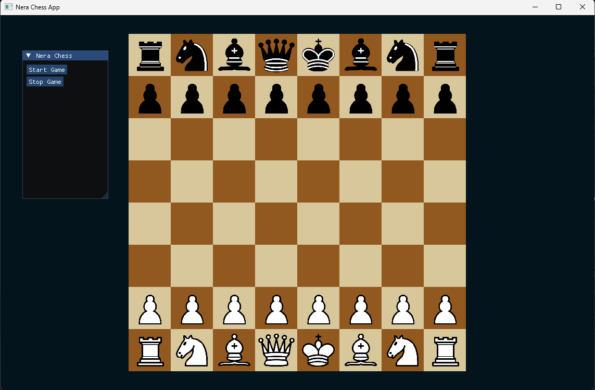

# NeraChess

[](https://github.com/raphaelhounsiagaman/NeraChess/actions/workflows/build.yml)
[](LICENSE)
[](https://lichess.org/@/NeraChess)
[](https://lichess.org/@/NeraChess)
[](https://lichess.org/@/NeraChess)

NeraChess is a C++23 chess engine, UCI executable, and SDL2/Dear ImGui desktop application. It combines a bitboard rules engine, deterministic classical search, clock-aware play, and cross-platform tooling in a layered codebase.



At engine commit `212e012`, a 300-game paired-opening tournament estimated
NeraChess at **2627 Stockfish 18 UCI-Elo-equivalent** at `10+0.1`, with a
paired-bootstrap 95% confidence interval of 2587--2664. This is a
hardware- and test-pool-specific engine benchmark, not a FIDE, online-platform,
or universal Elo rating. See the [strength calibration report](docs/ENGINE_STRENGTH.md)
for the results, method, and limitations.

The public [NeraChess Lichess bot](https://lichess.org/@/NeraChess) provides a separate real-world measurement. The badges above read its live Bullet, Blitz, and Rapid ratings from the Lichess API, so the repository does not rely on a manually maintained online rating. Lichess ratings are pool- and time-control-specific and should not be interpreted as FIDE Elo.

---

## Current Features

### Timed games

- Selectable `1 min`, `3 min + 2 sec`, `10 min`, `15 min + 10 sec`, and
  `90 min + 40 sec` time controls
- Independent White and Black clocks with increment after each completed move
- Live active-player highlighting, sub-ten-second tenths, and flag-fall results
- Search budgets derived from the bot's actual remaining time and increment

### Search

- Principal Variation Search (PVS)
- Iterative Deepening
- Lazy SMP search with a configurable shared transposition table
- Aspiration windows and mate-distance pruning
- Alpha-Beta Pruning
- Clustered transposition table with configurable size
- Logarithmic Late Move Reductions, scaled by history score, cut-node state, and
  whether the position is improving
- Null-move, reverse futility, futility, late-move-count, delta, and
  static-exchange pruning
- Internal iterative reduction on nodes with no stored move
- Static-evaluation stack driving an "improving" signal for every margin
- Quiescence Search
- Killer Moves
- Side-aware history, killer, and countermove heuristics
- Tapered piece-square, pawn-structure, mobility, and king-safety evaluation
- Indexed opening book with transposition-aware lookup
- Clock-aware time management
- UCI protocol support, including opponent-time pondering

The search favors clear, testable engine techniques over platform-specific micro-optimization.

---

## Architecture

NeraChess follows a layered architecture inspired by the application structure shown in The Cherno’s C++ Application Architecture series on YouTube.

The goal of this structure is separation of concerns rather than extreme abstraction. The project is divided into logical layers with clear responsibilities:

- `NeraChessEngine`: board state, legal move generation, hashing, clocks, and rules
- `NeraChessSearch`: evaluation, search, transposition table, time management, and opening book
- `NeraChessUCI`: headless asynchronous UCI protocol adapter
- `NeraChessApp`: SDL/ImGui desktop application and chess-player adapters
- `NeraChessTests`: headless perft, state, search, tactical, book, and benchmark coverage

---

## Dependencies

### Included in Repository

- Dear ImGui
- SDL2 headers and Windows libraries
- Premake for Windows and Linux project generation

### macOS dependencies

The macOS build uses native Homebrew libraries instead of the checked-in
Windows binaries:

```sh
brew install premake sdl2-compat sdl2_image sdl2_mixer
```

---

## Build

NeraChess requires a compiler and standard library with C++23 `std::format`
and `std::print` support.

### macOS

Requirements:

- Apple Silicon or Intel Mac
- Xcode and the Xcode Command Line Tools
- The Homebrew dependencies listed above

Generate an Xcode workspace from the repository root:

```sh
./scripts/Setup-macOS.sh
open NeraChess.xcworkspace
```

Select the `NeraChessApp` scheme and build or run the Debug or Release
configuration.

For a terminal build, generate GNU Makefiles instead:

```sh
./scripts/Setup-macOS.sh gmake
make config=release
./bin/Release/NeraChessApp/NeraChessApp
```

The headless UCI engine can be launched directly or configured in any
UCI-compatible chess GUI:

```sh
./bin/Release/NeraChessUCI/NeraChessUCI
```

It supports standard position setup, `go` depth/node/time limits,
`searchmoves`, asynchronous `stop`, `ponder`/`ponderhit`, hash sizing and
clearing, configurable `Threads`, `OwnBook`, `BookFile`, and `Ponder` options,
bundled opening-book play, and iterative `info` output.

NeraChess defaults to one UCI search thread for reproducible engine matches.
Configure additional workers with the standard option, for example:

```text
setoption name Threads value 4
```

Workers keep private boards and move-ordering heuristics while sharing a
concurrency-safe transposition table and one aggregate time/node budget. The
desktop bot automatically uses up to four hardware threads.

When `Ponder` is enabled, normal searches include the predicted opponent reply
in `bestmove ... ponder ...` when one is available. A `go ponder` search remains
silent until the GUI sends `ponderhit` for a correct prediction or `stop` for a
different move. The saved clock budget starts at `ponderhit`, so the opponent's
thinking time is not charged to NeraChess. For `lichess-bot`, enable this
behavior with:

```yaml
engine:
  ponder: true
```

UCI clocks are supplied by the controlling chess GUI on each search rather
than stored by the engine process. NeraChess supports the standard `wtime`,
`btime`, `winc`, `binc`, and `movestogo` fields, for example:

```text
position startpos moves e2e4 e7e5
go wtime 178400 btime 179100 winc 2000 binc 2000 movestogo 38
```

All UCI clock values are milliseconds. NeraChess selects the clock belonging
to the side to move, preserves a flag-fall reserve, and returns before its hard
time budget while still using iterative-deepening results from completed
depths.

Set `NERACHESS_MACOS_DEPENDENCY_PREFIX` before project generation only when
the SDL libraries are installed under a prefix other than `brew --prefix`.

### Windows

Requirements:

- Visual Studio 2026 with the Desktop development with C++ workload, or a
  recent Visual Studio 2022 installation with C++23 library support

Generate the default Visual Studio 2026 solution from any working directory:

```bat
scripts\Setup-Windows.bat
```

To generate Visual Studio 2022 files instead:

```bat
scripts\Setup-Windows.bat vs2022
```

Open `NeraChess.slnx` for Visual Studio 2026 or `NeraChess.sln` for Visual
Studio 2022, select Debug or Release, and build `NeraChessApp`.

### Linux headless engine

The bundled Linux Premake executable can generate Makefiles for the engine,
UCI target, and regression suite without SDL:

```sh
bash ./scripts/Setup-Linux.sh gmake
make -C NeraChessEngine config=release
make -C NeraChessSearch config=release
make -C NeraChessUCI config=release
make -C NeraChessTests config=release
./bin/Release/NeraChessTests/NeraChessTests
./bin/Release/NeraChessUCI/NeraChessUCI
```

The macOS and Windows GUI builds copy the `Resources` directory beside the
executable. The UCI build copies the opening book beside its executable on all
platforms. Both targets resolve their bundled resources from the executable,
so they can be launched from any working directory.

To verify SDL initialization, resource loading, and clean game-thread shutdown
without entering the application loop, run a built executable with:

```sh
./bin/Debug/NeraChessApp/NeraChessApp --smoke-test
```

## Verification and benchmarks

The normal regression suite includes 17 reference perft positions, make/undo
and hash invariants, draw rules, FEN validation, transposition-table behavior,
evaluation symmetry, tactical search choices, time management, and the full
opening-book index:

```sh
./bin/Release/NeraChessTests/NeraChessTests
```

Deterministic perft/search benchmarks and a fixed-time thread-scaling benchmark
are also available:

```sh
./bin/Release/NeraChessTests/NeraChessTests --bench
./bin/Release/NeraChessTests/NeraChessTests --search-bench
./bin/Release/NeraChessTests/NeraChessTests --thread-bench
```

`--thread-bench` is a quick, scheduling-sensitive scaling diagnostic rather
than a reproducible Elo measurement.

---

## Known Limitations

- Evaluation parameters are hand-tuned rather than trained from games.
- Search performance and calibrated strength depend on hardware, thread count, and time control.

---

## Contributing

Bug reports and focused pull requests are welcome. See [CONTRIBUTING.md](CONTRIBUTING.md) for build, test, style, and review expectations.

---

## Third-party software

The repository includes Dear ImGui, SDL2 development files for Windows, and Premake. Their respective license files remain alongside the vendored code. SDL2_image and SDL2_mixer runtime files also include their upstream and optional-codec notices.

---

## License

NeraChess is available under the [MIT License](LICENSE).
